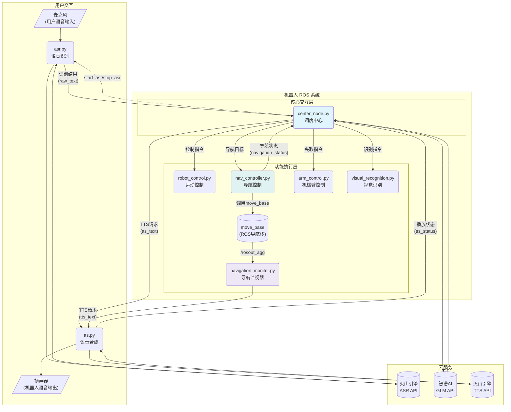

# TurtleBot 智能语音助手

本项目是一个基于ROS (Robot Operating System) 的智能语音助手，专为TurtleBot机器人设计，旨在为视障人士提供环境感知、导航和交互辅助。系统集成了火山引擎的语音技术和智谱AI的GLM大语言模型，实现了自然的语音交互能力。

## 最新架构改进（v2.0）

本项目经过重大架构升级，实现了**零延迟丝滑交互**和**完全杜绝回环**的设计目标。

### 核心改进

#### 1. **精确的服务调度机制**
- **前版本**：基于话题的异步通知，存在延迟和不可靠性
- **当前版本**：基于ROS服务调用的同步控制，确保精确的状态管理

#### 2. **ASR节点重新设计**
- **前版本**：启动时持续录音识别，通过TTS状态回调暂停/恢复
- **当前版本**：
  - 默认停止状态，等待启动指令
  - 提供`start_asr`和`stop_asr`服务接口
  - 识别完成后**自动停止**，避免持续API调用
  - 完全消除TTS播放期间的API访问

#### 3. **Center_node作为调度中心**
- **前版本**：被动接收语音指令，缺乏主动调度能力
- **当前版本**：
  - 统一的系统调度中心
  - 主动控制ASR的启停时机
  - 协调整个交互流程
  - 处理异常情况下的状态恢复

#### 4. **交互流程优化**

**前版本流程**：
```
ASR持续运行 → TTS播放时暂停ASR → TTS结束恢复ASR → 可能存在状态不一致
```

**当前版本流程**：
```
启动 → Center启动ASR → 用户说话 → ASR识别完成并自停 → 
Center处理指令 → Center发送TTS → TTS播放 → TTS完成通知 → 
Center重启ASR → 完美循环
```

### 技术优势

1. **零延迟响应**：服务调用确保立即的状态切换，无需任何人工延迟
2. **完全杜绝回环**：ASR在TTS播放期间完全停止，包括录音和API调用
3. **资源高效**：避免不必要的API调用，节省成本和带宽
4. **稳定可靠**：精确的状态管理，消除竞态条件和状态不一致
5. **容错性强**：异常情况下自动恢复到正常交互状态

### 混合通信机制设计

本系统采用**ROS话题(Topics) + 服务(Services)**的混合通信架构，遵循"用对的工具做对的事"的设计原则：

#### 🔄 **数据传递** - 使用ROS话题
```
用户语音 → ASR识别 → raw_text话题 → Center处理 → tts_text话题 → TTS合成
                                    ↓
                           robot_command话题 → 运动控制
                           nav_cmd话题 → 导航控制  
                           arm_cmd话题 → 机械臂控制
                           visual_cmd话题 → 视觉识别
```

**话题用于数据传递的优势**：
- **异步传输**：不阻塞发送方，适合连续数据流
- **多订阅者**：一个话题可以被多个节点同时订阅
- **松耦合**：发布者不需要知道订阅者的存在状态
- **高吞吐量**：适合语音文本、传感器数据等高频数据

#### 🎛️ **节点控制** - 使用ROS服务
```
Center调度中心 ←→ start_asr/stop_asr服务 ←→ ASR节点
               ←→ tts_status话题 ←→ TTS节点
```

**服务用于控制操作的优势**：
- **同步确认**：确保控制指令被成功执行并返回结果
- **状态可靠**：调用方能明确知道操作是否成功
- **精确控制**：适合启动/停止这类状态切换操作
- **错误处理**：可以返回详细的错误信息和状态码

#### 📋 **设计原理总结**

| 通信类型 | 使用场景 | 特点 | 示例 |
|----------|----------|------|------|
| **话题** | 数据传递 | 异步、高吞吐、松耦合 | 语音文本、控制指令 |
| **服务** | 状态控制 | 同步、可靠、有反馈 | ASR启停、系统状态查询 |

这种混合架构确保了：
- **数据流畅通**：话题保证数据传递的高效性
- **控制精确**：服务保证状态操作的可靠性  
- **系统解耦**：数据处理和状态控制职责分离
- **易于调试**：可以清楚区分数据问题和控制问题

## 系统架构



**图例说明**：
- 实线箭头：数据流（话题通信）
- 虚线箭头：控制流（服务调用/状态通知）
- 蓝色高亮：调度中心
- 紫色高亮：受控的ASR节点
- 橙色高亮：TTS节点

## 功能特点

- **🎯 零延迟丝滑交互**: 基于ROS服务调用的精确调度，实现即时响应无延迟的自然对话体验。
- **🚫 完全杜绝回环**: 创新的启停调度机制，确保TTS播放期间ASR完全停止，彻底避免自我识别。
- **🧠 智能语义理解**: 采用智谱AI `GLM-4-Flash` 大模型进行意图分析，能够准确理解用户多样化的指令。
- **🔊 高质量语音**: 集成火山引擎语音服务，提供清晰的语音识别（ASR）和自然的语音合成（TTS）。
- **🤖 多模态能力**:
  - **语音控制**: 控制机器人前进、后退、左转、右转、停止
  - **自主导航**: 告知机器人目标地点（如"带我去301房间"），即可启动AMCL自主导航
  - **机械臂操作**: 支持通过语音控制机械臂执行抓取任务
  - **视觉识别**: 可要求机器人描述其前方的景象
- **智能导航交互**:
  - **精细状态播报**: 明确播报导航成功、失败、被取消等状态，并解释可能的原因。
  - **主动绕行提示**: 当机器人遇到障碍并尝试绕行时，会主动语音告知用户，提升交互的透明度和用户的安全感。
  - **导航冲突保护**: 在自主导航期间，系统会自动屏蔽"前进"等低级运动指令，防止行为冲突。
- **⚡ 资源高效**: 按需启停的设计避免不必要的API调用，节省成本和带宽。
- **🛡️ 稳定可靠**: 统一调度中心管理系统状态，通过多节点协作实现强大的异常恢复能力。

## 系统要求与依赖

- **硬件**:
  - TurtleBot 2/3 机器人
  - 可用的麦克风和扬声器
- **软件**:
  - Ubuntu 20.04
  - ROS Noetic
  - Python 3.8+
  - `zhipuai`: 智谱AI Python SDK
  - `pyaudio`: 用于录音和播放
  - `websockets`: 用于API通信

## 安装与设置

### 1. 安装依赖项

首先，确保您的ROS环境已正确配置。然后运行项目中的安装脚本，它会自动安装所需的Python包。

```bash
# 进入脚本所在目录
cd ~/catkin_ws/src/blind_assistant1/scripts

# 授予执行权限并运行
chmod +x setup.sh
./setup.sh
```

### 2. 设置API密钥

本项目需要火山引擎和智谱AI的API密钥才能正常工作。为了安全和便捷，请将密钥设置为环境变量。

打开您的 `.bashrc` 文件：
```bash
gedit ~/.bashrc
```

在文件末尾添加以下三行，并将 `"你的..."` 替换为您自己的密钥：
```bash
# 火山引擎 AppID
export VOLC_APP_ID="你的AppID"
# 火山引擎 Access Key
export VOLC_ACCESS_KEY="你的AccessKey"
# 智谱AI API Key
export ZHIPUAI_API_KEY="你的ZhipuAI API Key"
```
保存并关闭文件，然后执行 `source ~/.bashrc` 使其生效。

- **火山引擎密钥**: 请参考 [火山引擎控制台](https://console.volcengine.com/) 获取。
- **智谱AI密钥**: 请参考 [智谱AI开放平台](https://open.bigmodel.cn/) 获取。

### 3. 编译工作空间

回到您的catkin工作空间根目录，并进行编译。

```bash
cd ~/catkin_ws
catkin_make
```

## 使用方法

编译成功后，使用以下 `roslaunch` 命令启动整个系统：

```bash
roslaunch blind_assistant1 start_all.launch
```

该命令会启动TurtleBot底层驱动、AMCL导航系统以及本项目的所有核心节点。启动后，您可以通过语音与机器人进行交互。

**语音指令示例**:
- "前进" / "后退一点"
- "带我去301房间"
- "帮我抓住那个瓶子"
- "眼前有什么东西？"
- "你叫什么名字？" (通用对话)

## 项目结构

```
blind_assistant1/
├── launch/
│   └── start_all.launch        # 主启动文件，启动所有节点
├── scripts/
│   ├── asr.py                  # 语音识别服务 (受控)
│   ├── center_node.py          # 统一调度中心 (大脑)
│   ├── tts.py                  # 语音合成服务
│   ├── robot_control.py        # 机器人低级运动控制
│   ├── nav_controller.py       # 机器人高级导航控制
│   ├── navigation_monitor.py   # 导航状态监视器 (新增)
│   ├── arm_control.py          # 机械臂控制接口
│   ├── visual_recognition.py   # 视觉识别功能
│   └── setup.sh                # 依赖安装脚本
└── README.md                   # 本文档
```

### 核心节点说明

#### 📡 asr.py - 语音识别节点 (重大升级)
- **服务接口**: 提供`/start_asr`和`/stop_asr`服务，由`center_node`精确控制。
- **按需运行**: 只在需要时启动，识别完成或被命令时停止，杜绝回环和API浪费。

#### 🎛️ center_node.py - 统一调度中心 (全新设计)
- **系统大脑**: 统一管理整个交互流程，集成智谱AI进行语义分析和任务分发。
- **精确调度**: 通过服务调用精确控制ASR启停。**监听`/navigation_status`**，确保导航期间ASR保持关闭。
- **冲突管理**: 在导航进行时，**主动屏蔽**手动运动指令，防止行为冲突。

#### 🔊 tts.py - 语音合成节点
- **状态通知**: 实时发布播放状态(`/tts_status`)，告知`center_node`何时可以重启ASR。
- **高质量合成**: 集成火山引擎TTS API。
- **流式播放**: 支持长文本的流式语音合成。

#### 🧭 nav_controller.py - 导航控制器
- **高级控制**: 负责接收导航目标，并调用`move_base`执行。
- **ASR生命周期管理**: 在导航开始时调用`/stop_asr`服务，在导航结束后调用`/start_asr`服务。
- **状态发布**: 发布`/navigation_status`话题，向系统广播当前是否处于导航中。
- **精细语音反馈**: 根据`move_base`返回的最终状态（成功、失败、被抢占等），发布详细的语音播报。

#### 🧐 navigation_monitor.py - 导航监视器 (新增)
- **主动提醒**: 独立于主流程，通过监听ROS日志，在`move_base`尝试恢复行为（如旋转、清理代价地图以绕开障碍物）时，主动发布语音播报，告知用户"正在尝试绕行"。
- **用户体验增强**: 极大地提升了用户在机器人自主行为期间的安全感和对情况的了解。

## 自定义配置

### 更改TTS音色

您可以轻松更改语音合成的音色。
1.  在 [火山引擎音色列表](https://www.volcengine.com/docs/6561/107530) 中选择您喜欢的音色。
2.  打开 `tts.py` 文件: `gedit ~/catkin_ws/src/blind_assistant1/scripts/tts.py`
3.  找到以下这行代码（约在31行）:
    ```python
    self.voice_type = rospy.get_param('~voice_type', 'zh_male_shaonianzixin_moon_bigtts')
    ```
4.  将 `'zh_male_shaonianzixin_moon_bigtts'` 替换为您选择的音色ID即可。

## 注意事项

- **网络连接**: 所有云API的调用都需要稳定的互联网连接。
- **环境噪音**: 为获得最佳的语音识别效果，请尽量在安静的环境中使用。
- **安全**: 启动导航功能前，请确保地图和定位(AMCL)已正常工作，并为机器人留出足够的安全空间。
- **API用量**: 请注意您在火山引擎和智谱AI平台的API调用额度。 

# 工作流程
好的，非常乐意为您详细介绍这三个关键节点的工作原理和方法。我将结合代码和您项目的整体逻辑，逐一进行拆解。

### 1. 语音识别 (`asr.py`)

**核心目标**：捕捉用户的语音，通过火山引擎的ASR（自动语音识别）服务将其转换成文本字符串，并发布出去供其他节点使用。

**工作原理与方法**：
`asr.py` 的工作可以看作是一个由 "录音线程" 和 "通信线程" 协同工作的生产者-消费者模型。

1.  **启动与停止 (`start_asr_callback`, `stop_asr_callback`)**:
    *   该节点本身不主动工作，而是通过ROS服务被 `center_node` 控制。
    *   当 `center_node` 调用 `/start_asr` 服务时，`start_asr_callback` 函数被触发。它会设置一个 `is_active` 标志位为 `True`，并启动下面的两个核心线程，开始语音识别流程。
    *   当 `center_node` 调用 `/stop_asr` 服务时，`is_active` 标志位被设为 `False`，所有线程会检测到这个标志并安全退出循环，停止工作。

2.  **录音线程 (`recording_thread`)**:
    *   **角色**：音频的"生产者"。
    *   **方法**：
        *   使用 `pyaudio` 库持续从麦克风读取音频数据，每次读取一个数据块（Chunk）。
        *   它包含一个简单的 **静音检测** (`is_silence`) 逻辑。如果录到的音频块音量低于阈值 (`silence_threshold`)，就被认为是静音。
        *   如果不是静音，它就将这个音频数据块放入一个共享的 `audio_queue`（音频队列）中。
        *   如果检测到 **连续的静音** (例如，超过1.5秒，由 `max_silence_frames` 控制)，它会向队列中放入一个特殊的"结束标记"，告诉通信线程"这句话说完了"。

3.  **WebSocket通信线程 (`websocket_thread`)**:
    *   **角色**：音频的"消费者"和文本的"生产者"。
    *   **方法**：
        *   在 `start_asr` 被调用后，此线程会与火山引擎的ASR WebSocket服务器建立长连接。
        *   它不断地从 `audio_queue` 中取出音频数据块。
        *   每取出一个数据块，就将其通过WebSocket协议发送给服务器。
        *   服务器会实时地返回识别结果。`parse_response` 方法负责解析这些返回的数据。
        *   当它收到最终识别结果时（由 `publish_final_sentence` 函数处理），它会将最终的文本字符串发布到ROS的 `raw_text` 话题上。
        *   **关键逻辑（已修复）**：当它从队列中取到"结束标记"时，它会向服务器发送一个最终数据包，然后 **主动断开当前循环**，等待外部重连。这确保了每次对话的连接都是干净的，避免了延迟和错误。

**总结**：`asr.py` 是一个高效的实时语音转文字模块，它通过服务调用被精确控制启停，并利用双线程模型实现了音频录制与云端通信的并行处理。

---

### 2. 语音合成 (`tts.py`)

**核心目标**：订阅一个包含文本的话题，通过火山引擎的TTS（文本转语音）服务将文本合成为语音，并通过机器人的扬声器播放出来。

**工作原理与方法**：
`tts.py` 的工作流程与ASR类似，也采用生产者-消费者模型，但方向相反。

1.  **接收文本 (`tts_callback`)**:
    *   **入口**：该节点的核心入口是 `tts_callback` 函数，它订阅了 `tts_text` 话题。任何节点（主要是 `center_node` 和 `visual_recognition.py`）只要向这个话题发布一个字符串，就会触发这个回调。
    *   **中断机制**：当收到新的文本时，它会立即清空待播放的 `audio_queue`，这样可以打断上一句还未说完的话，立即播报新的内容，保证了响应的及时性。
    *   **异步处理**：为了不阻塞ROS的消息系统，它会启动一个独立的 `tts_thread` 线程去执行网络请求和音频流处理。

2.  **TTS请求与音频接收 (`tts_request`)**:
    *   **角色**：音频流的"生产者"。
    *   **方法**：
        *   这个函数运行在独立的线程中。它使用 `websockets` 库与火山引擎的TTS服务器建立连接。
        *   它将收到的文本（如"好的，我将带您去327房间"）打包成一个JSON请求，通过WebSocket发送给服务器。
        *   服务器会以流式（streaming）的方式，源源不断地返回合成好的PCM（原始脉冲编码调制）音频数据。
        *   该函数接收到这些音频数据流后，将其一块一块地放入 `audio_queue` 队列中。

3.  **音频播放 (`audio_playback_thread`)**:
    *   **角色**：音频流的"消费者"。
    *   **方法**：
        *   这个线程在节点启动时就已经开始运行，在后台循环。
        *   它不断地从 `audio_queue` 中取出PCM音频数据。
        *   使用 `pyaudio` 库将这些原始音频数据直接写入到音频输出设备（扬声器），我们就能听到声音了。
        *   **状态反馈**：这是非常关键的一步。在开始播放第一块音频时，它会向 `tts_status` 话题发布 "playing"。当 `audio_queue` 为空且TTS网络请求已全部完成时，它会发布 "stopped"。`center_node` 正是靠监听这个 "stopped" 状态来决定何时重启ASR，从而形成一个完整的交互闭环。

**总结**：`tts.py` 是一个响应式的文本转语音模块，它通过话题订阅接收任务，利用异步和队列实现了流畅的音频合成与播放，并通过状态反馈机制与系统的核心控制节点协同工作。

---

### 3. 机械臂夹取 (`arm_control.py`)

**核心目标**：接收来自中央节点的夹取指令，并协调导航系统与底层机械臂驱动来完成一次夹取任务。

**工作原理与方法**：
这个节点的功能相对简单，是一个纯粹的指令执行者，其逻辑完全包含在 `arm_cmd_callback` 回调函数中。

1.  **触发方式 (`arm_cmd_callback`)**:
    *   `center_node` 在理解用户意图为"机械臂夹取"后，会向 `arm_cmd` 话题发布一个 "true" 的消息。
    *   `arm_control.py` 订阅了此话题，收到消息后便触发 `arm_cmd_callback` 函数。

2.  **执行流程**：
    *   **第一步：启动机械臂**。它首先向 `arm_action` 话题发布 "start"。根据您的项目结构推断，应该有一个未在此处显示的底层脚本（如 `arm_demo.py`）订阅了这个话题，负责驱动舵机等硬件，开始执行预设的夹取动作。
    *   **第二步：等待**。代码执行 `rospy.sleep(5)`，强制等待5秒。这可能是在预估机械臂完成动作所需的时间。
    *   **第三步：执行导航**。等待结束后，它会向 `voice_cmd2` 话题发布 "302"。
    *   **后续联动**：`nav_controller.py` 节点订阅了 `voice_cmd2` 话题，收到 "302" 后，会控制机器人导航到预设的"302"号位置。

**逻辑分析与潜在问题**:
正如我之前所分析的，当前的工作流程是 "先动手夹取，再导航"。

*   **当前实现**：机器人原地开始做夹取动作，5秒后，再开始移动到"302"位置。
*   **现实逻辑**：一个更合理的流程应该是机器人 **先导航到目标物（如水瓶）所在的位置，然后再伸出机械臂进行夹取**。

**总结**：`arm_control.py` 目前是一个线性的、顺序执行的控制器。它成功地将一个高层指令（`arm_cmd`）分解成了两个低层动作（`arm_action` 和导航），但其执行顺序与现实世界的操作逻辑相反，这是未来可以优化的一个方向。