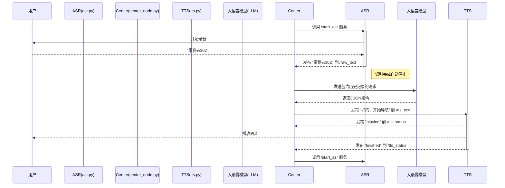

# 盲人引导机器人功能原理与实现

## 一、 系统核心架构

本系统采用**中心化调度**的设计思想，以`center_node.py`为核心，负责接收所有用户指令、进行语义理解，并将任务分发给对应的功能节点。这种架构确保了各模块的职责单一（高内聚、低耦合），并实现了对复杂交互流程（如语音与导航互斥）的统一管理。

其通信模式为**话题与服务混合使用**：
- **话题 (Topics)**: 用于传递**异步数据流**，如语音识别文本、TTS播报内容、导航状态等。
- **服务 (Services)**: 用于执行**同步控制命令**，如启动/停止ASR，确保指令被精确执行并获得反馈。

---

## 二、 核心语音交互与调度

这是系统的中枢神经，由`asr.py`(语音识别)、`center_node.py`(调度中心)和`tts.py`(语音合成)协同工作，实现了完整的"听-想-说"闭环。

### 2.1 原理

该功能的核心是**基于服务调用的精确状态机**，以`center_node`为主导，解决了传统语音交互中的"声音回环"和"API资源浪费"两大痛点。

**交互流程图:**


### 2.2 实现

1.  **ASR节点 (`asr.py`)**:
    - **受控启动**: 节点默认不工作。它提供`/start_asr`和`/stop_asr`两个服务接口。
    - **自动停止**: 在用户一句话说完（检测到静音）并成功发出识别文本后，它会自动停止录音和API请求，进入待命状态，等待`center_node`的下一次唤醒。

2.  **调度中心 (`center_node.py`)**:
    - **主导ASR**: 在一次交互结束后（如TTS播报完毕），`center_node`会调用`/start_asr`服务来"唤醒"ASR。当收到ASR的识别结果后，它立即调用`/stop_asr`服务，确保ASR在后续的LLM处理和TTS播报期间处于关闭状态。
    - **意图理解**: 将ASR识别的文本和对话历史一并打包，发送给智谱AI的GLM大语言模型，并要求其返回标准化的JSON指令。
    - **任务分发**: 解析LLM返回的JSON，根据`"request"`字段的值（如"导航"、"运动控制"等），将具体任务发布到相应的话题。

3.  **TTS节点 (`tts.py`)**:
    - **状态反馈**: 这是形成闭环的关键。TTS节点在开始播放音频时，会向`/tts_status`话题发布`"playing"`；在播放完全结束后，会发布`"finished"`。
    - **精确重启**: `center_node`通过监听`/tts_status`话题。一旦收到`"finished"`消息，就认为本次交互的"说"环节已结束，可以安全地启动ASR，准备下一次"听"，从而形成一个完美的交互循环。

---

## 三、 自主导航功能

该功能允许用户通过语音指令（如"带我去302房间"）控制机器人自主移动到地图上的预设目标点。

### 3.1 原理

本功能是**高层任务规划**与ROS标准**导航栈(`move_base`)**的结合。`nav_controller.py`节点充当"翻译官"，将人类的语言目标（"302房间"）转换为机器人可以理解的精确坐标，并交由`move_base`执行。同时，通过`navigation_monitor.py`提升了用户在导航过程中的体验。

**导航流程图:**
```mermaid
graph TD
    A[用户语音: “去302”] --> B{center_node}
    B -- 发布目标地点 --> C[/navigation_command]
    C --> D[nav_controller.py]
    D --> E[坐标转换]
    E --> F[生成MoveBaseGoal]
    F --> G[move_base节点]
    G --> H[发布/cmd_vel]
    H --> I[机器人底盘]
    
    subgraph 状态反馈
        G --> J[/navigation_status]
        G --> K[/rosout_agg]
    end
    
    J --> B
    K --> L[navigation_monitor.py]
    L -- 障碍提醒 --> M[/tts_text]
    M --> N[tts.py]
```

### 3.2 实现

1.  **导航指令接收 (`nav_controller.py`)**:
    - 订阅`/navigation_command`话题，等待`center_node`发布的目标地点名称（如`"302"`）。
    - 内置一个`room_locations`字典，存储着地点名称到地图精确坐标（位置+姿态四元数）的映射。

2.  **目标点生成与发送**:
    - 当收到有效地点名称后，节点会创建一个`move_base_msgs/MoveBaseGoal`类型的消息。
    - 它从字典中查出对应的7维坐标（X, Y, Z, qx, qy, qz, qw），填充到`goal`消息中。
    - 调用`move_base`的Action客户端`self.move_base.send_goal()`，将该目标发送给ROS导航栈。

3.  **状态管理与反馈**:
    - **启动时**: 发送导航目标的同时，向`/navigation_status`话题发布`"active"`，通知`center_node`进入导航模式（期间会暂停ASR）。
    - **结束后**: 为`send_goal`方法注册一个完成回调函数`navigation_done_callback`。当导航结束（无论成功、失败或被取消），该回调函数会被触发。它会：
        - 向`/navigation_status`发布`"idle"`，通知`center_node`导航已结束。
        - 根据`move_base`返回的最终状态码（`SUCCEEDED`, `ABORTED`等），生成详细的、人性化的提示语（如"导航失败，可能路径被阻塞..."），并发布给TTS节点进行播报。

4.  **主动绕行提醒 (`navigation_monitor.py`)**:
    - 这是一个独立于主流程的"体验增强"节点。
    - 它不参与控制，只订阅`/rosout_agg`（ROS日志聚合话题）。
    - 通过关键词（如`"Starting recovery behavior"`）匹配，判断`move_base`是否正在尝试自主避障（如原地旋转、清理代价地图等）。
    - 一旦检测到，它会主动发布TTS消息（如"检测到障碍物，正在尝试绕行"），让用户了解机器人的当前状况，增加安全感。

---

## 四、 机械臂操作

该功能实现了通过语音指令控制`my_dynamixel`机械臂执行预设的抓取序列，并在动作完成后自动导航回指定位置。

### 4.1 原理

这是一个**分层控制**的实现。`blind_assistant1`包中的`arm_control.py`作为**高层控制器**，负责接收`center_node`的简单指令。`my_dynamixel`包中的`arm_demo.py`作为**底层控制器**，负责驱动机械臂硬件执行具体的、预设的动作序列。

**机械臂操作流程:**
```mermaid
graph TD
    A[用户语音: “帮我夹东西”] --> B{center_node}
    B -- 发布指令 --> C[/arm_command]
    C --> D[arm_control.py]
    D -- 触发底层 --> E[/arm_action]
    E --> F[arm_demo.py]
    
    subgraph 底层动作序列
        F --> G[移动到初始位置]
        G --> H[移动到预备位置]
        H --> I[闭合手爪]
        I --> J[移动到递送位置]
    end
    
    F -- 等待8秒 --> K{动作完成}
    K -- TTS通知 --> L[/tts_text]
    K -- 等待4秒 --> M{发送导航指令}
    M --> N[/navigation_command]
    N --> O[nav_controller.py]
```

### 4.2 实现

1.  **高层指令 (`arm_control.py`)**:
    - **指令接收**: 订阅`/arm_command`话题。当`center_node`识别到抓取意图时，会向此话题发布`"true"`。
    - **触发底层**: 收到指令后，它立即向`/arm_action`话题发布`"start"`，用以激活底层控制器`arm_demo.py`。
    - **等待与后处理**:
        - `rospy.sleep(8)`: 使用一个固定的8秒延时来等待底层动作完成。这是一个简单的开环控制，假设底层动作总能在8秒内完成。
        - **TTS通知**: 等待结束后，发布消息到`/tts_text`，告知用户动作已完成，并即将返航。
        - **自动返航**: 再等待4秒（预估TTS播报时间），然后向`/navigation_command`话题发布`"302"`，触发导航功能，让机器人自动回到预设点。

2.  **底层实现 (`arm_demo.py` from `my_dynamixel`)**:
    - **动作序列**: 该脚本内预定义了多个状态（初始、预备、夹取、递送），每个状态对应一组5个关节（`tilt`, `shoulder`, `elbow`, `wrist`, `hand`）的目标角度（弧度制）。
    - **指令触发**: 它订阅`/arm_action`话题。当收到`"start"`消息后，便开始按顺序执行预设的动作序列。
    - **关节控制**: 通过向`dynamixel_controllers`提供的多个`..._controller/command`话题发布`Float64`消息，来直接控制每个关节运动到指定角度。
    - **开环等待**: 在每一步动作指令发出后，同样使用固定的`rospy.sleep(2.0)`来等待动作完成，而不是通过反馈来精确判断。

---

## 五、 视觉场景识别

该功能允许用户通过语音（如"眼前有什么"）命令机器人描述其摄像头捕捉到的景象。

### 5.1 原理

这是一个**指令触发式**的多模态功能。`center_node`在识别到用户意图后，仅发出一个"开始识别"的信号，然后**保持静默**。真正的图像捕捉、API请求和语音播报完全由`video_cap.py`和`visual_recognition.py`两个节点协作完成，从而避免了`center_node`的通用回复与视觉节点的描述内容产生冲突。

**视觉识别流程:**
```mermaid
graph TD
    A[用户语音: “描述一下”] --> B{center_node}
    B -- 发布指令 --> C[/visual_command]
    C --> D[visual_recognition.py]
    
    subgraph 图像处理
        E[摄像头] --> F[video_cap.py]
        F -- 发布图像 --> G[/visual_info]
        G --> D
    end
    
    D -- 调用API --> H[视觉大模型]
    H -- 返回描述 --> D
    D -- 发布描述 --> I[/tts_text]
    I --> J[tts.py]
```

### 5.2 实现

1.  **指令分发 (`center_node.py`)**:
    - 在`execute_function_commands`方法中，对`"场景识别"`请求做了特殊处理。
    - 当`request`为`"场景识别"`时，它**不会**发布`data`中的`"content"`字段给TTS。
    - 它仅向`/visual_command`话题发布一个`"true"`的信号，然后直接`return`，结束自己的执行流程。

2.  **图像捕获 (`video_cap.py`)**:
    - 该节点持续从IP摄像头或USB摄像头读取视频帧。
    - 它会将每一帧图像发布到`/ip_camera/image_raw`话题，供RViz等工具实时监控。
    - **关键逻辑**：它还订阅了`/visual_command`。当收到`"true"`指令时，它会将**当前**捕获到的那一帧图像，额外发布到`/visual_info`话题。

3.  **识别与播报 (`visual_recognition.py`)**:
    - **等待指令**: 该节点通过`self.should_process`标志位进行状态控制，默认不处理图像。它订阅`/visual_command`，收到`"true"`后，才将`should_process`置为`True`。
    - **图像处理**: 它订阅`/visual_info`话题。在`should_process`为`True`时，它会接收一帧图像，然后立即将`should_process`置回`False`，确保一次指令只处理一张图。
    - **API调用**: 将接收到的图像进行Base64编码，然后连同一个固定的Prompt（"请描述你看到了什么。控制在20字以内"）一起，发送给火山`doubao-vision`视觉大模型。
    - **直接播报**: 接收到视觉模型返回的描述文本后，该节点**直接将文本发布到`/tts_text`话题**，交由TTS节点进行播报。这一步绕过了`center_node`，是避免输出冲突的关键。