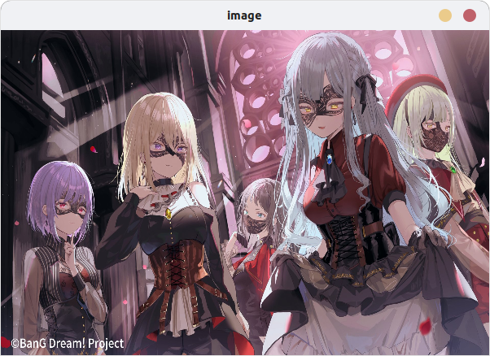

## Readme for HOMEWORK1
### 作业要求
##### 1.下载编译OpenCV3.4.1源码
##### 2.使用OpenCV3.4.1编写一个显示图片的程序
##### 3.使用CMake和make进行编译链接以上程序
##### 4.将本次作业的源码和编译好的程序上传到github和gitee仓库

### 作业步骤
#### opencv源代码下载与编译安装
1.在./homework1/目录下`mkdir opencv-3.4.1`新建文件夹opencv-3.4.1 **(该文件夹在安装opencv之后删除了)**  
2.`cd opencv-3.4.1`进入文件夹  
3.`git init`初始化git仓库  
4.使用`git clone https://github.com/opencv/opencv.git` 下载opencv源代码  
5.使用`git checkout 3.4.1`切换到3.4.1版本  
6.在opencv-3.4.1目录下`mkdir build`新建文件夹build
7.使用`cmake -S ./ -B build/`编译opencv  
8.使用`make`编译opencv  
9.使用`sudo make install`进行安装，这样opencv将会默认安装路径为  
>/usr/local/bin - executable files
/usr/local/lib - libraries (.so)
/usr/local/cmake/opencv4 - cmake package
/usr/local/include/opencv4 - headers
/usr/local/share/opencv4 - other files (e.g. trained cascades in XML format)
#### 编写显示一个图片的程序
新建一个cpp文档，代码内容如下：
```cpp
#include <iostream>
#include "opencv2/opencv.hpp"
using namespace std;
int main()
{
    cv::Mat img = cv::imread("test.jpg");
    cv::resize(img, img, cv::Size(600, 400));
    cv::imshow("image", img);
    cv::waitKey(0);
    return 0;
}
```
#### 使用CMake和make进行编译链接以上程序
1.`touch CMakeLists.txt`新建一个CMakeLists.txt  
2.该文档内容如下（注意要记得链接上opencv库）
```
cmake_minimum_required(VERSION 3.16.3)
project(show_image)
add_executable(show_image show_a_image.cpp) 

# 查找 OpenCV 库
find_package(OpenCV REQUIRED)

# 链接 OpenCV 库
target_link_libraries(show_image ${OpenCV_LIBS})
```
3.在homework1文件夹下进入终端输入`cmake ./`进行编译生成Makefile（一般来说为了目录简洁美观会单独新建build文件夹用于存储编译程序，这里为了方便就都放在初始目录下了）
4.之后输入`make`编译出程序

#### 程序运行及展示
终端输入`./show_image`运行程序，结果如下图：

