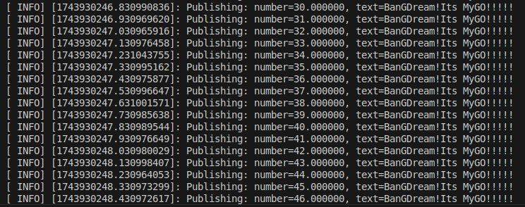
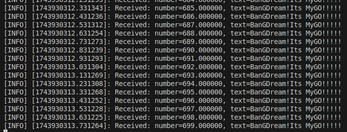

## HOMEWORK 3   
### Requirements
##### 编写简单的消息发布器与订阅器：
- 消息有浮点数和字符串两种数据类型组成
- 消息发布器采用C++编写
- 消息订阅器采用Python编写
- 上传发布器和订阅器的代码及说明文档
### 实现效果
#### 消息发布器

#### 消息订阅器

### 操作指南
- 本文件夹中的homework3文件夹为完整的ROS包，cpp_publisher.cpp和python_subscriber.py分别为单独拿出来的消息发布器和订阅器的实现文件。
- 运行时请将ROS包放在你的ROS工作空间的src目录下。
#### 启动ROS核心
```bash
roscore
```
#### 启动消息发布器
```bash
rosrun homework3 homework3_node
```
#### 启动消息订阅器
```bash
rosrun homework3 python_subscriber.py
```
#### 注意事项
新建终端后记得
```bash
source YOUR_PATH_TO_WORKSPACE/devel/setup.bash
```
### 具体步骤
#### 创建自定义消息
##### 1.创建ROS包 
假设我们已经存在一个ROS工作空间，进入该工作空间的src目录使用
```bash
catkin_create_pkg homework3 roscpp rospy std_msgs message_generation message_runtime
```
创建一个名为homework3的ROS包，包含roscpp、rospy、std_msgs、message_generation和message_runtime这几个依赖包。
##### 2.创建消息文件
进入homework3包的msg目录，创建一个名为CustomMessage.msg的文件，内容如下：
```bash
float32 number
string text
```
##### 3.修改 package.xml
在homework3包的package.xml文件中添加以下内容：
```xml
<build_depend>message_generation</build_depend>
<exec_depend>message_runtime</exec_depend>
```
确保xml文件中包含如下的内容：
```xml
  <build_depend>roscpp</build_depend>
  <build_depend>rospy</build_depend>
  <build_depend>std_msgs</build_depend>
  <build_depend>message_generation</build_depend>
  <build_export_depend>roscpp</build_export_depend>
  <build_export_depend>std_msgs</build_export_depend>
  <exec_depend>roscpp</exec_depend>
  <exec_depend>std_msgs</exec_depend>
  <exec_depend>message_runtime</exec_depend>
  <exec_depend>rospy</exec_depend>
```
##### 4.修改 CMakeLists.txt
在homework3包的CMakeLists.txt文件中添加以下内容：
```cmake
find_package(catkin REQUIRED COMPONENTS
  roscpp
  rospy
  std_msgs
  message_generation
)

add_message_files(
  FILES
  CustomMessage.msg
)

generate_messages(
  DEPENDENCIES
  std_msgs
)

catkin_package(
  CATKIN_DEPENDS message_runtime roscpp rospy std_msgs
)
```
##### 5.编译ROS包
```bash
cd ~/YOUR_PATH_TO_WORKSPACE
catkin_make
source devel/setup.bash
```
#### C++消息发布器实现
##### 1.创建消息发布器
在homework3包的src目录下创建一个名为cpp_publisher.cpp的文件，内容如下：
```cpp
#include <ros/ros.h>
#include <homework3/CustomMessage.h> 
#include <sstream>

int main(int argc, char *argv[]) {
    ros::init(argc, argv, "talker");
    ros::NodeHandle n;
    
    // 发布自定义消息到 "chatter" 话题
    ros::Publisher chatter_pub = n.advertise<homework3::CustomMessage>("chatter", 1000);
    ros::Rate loop_rate(10);

    int count = 0;
    while (ros::ok()) {
        homework3::CustomMessage msg;  // 自定义消息类型
        msg.number = count * 1.0f;             // 设置 float 字段
        msg.text = "BanGDream!Its MyGO!!!!!";  // 设置 string 字段

        ROS_INFO("Publishing: number=%f, text=%s", msg.number, msg.text.c_str());
        chatter_pub.publish(msg);

        ros::spinOnce();
        loop_rate.sleep();
        ++count;
    }
    return 0;
}
```
##### 2.修改 CMakeLists.txt 添加可执行文件
在homework3包的CMakeLists.txt文件中添加以下内容：
```cmake
add_executable(${PROJECT_NAME}_node src/cpp_publisher.cpp)
add_dependencies(cpp_publisher ${${PROJECT_NAME}_EXPORTED_TARGETS} ${catkin_EXPORTED_TARGETS})
target_link_libraries(cpp_publisher
  ${catkin_LIBRARIES}
)
```
#### Python订阅器实现实现
##### 1.创建Python订阅器
在homework3包的scripts目录下创建一个名为python_subscriber.py的文件，内容如下：
```python
#!/usr/bin/env python
import rospy
from homework3.msg import CustomMessage

def callback(data):
    rospy.loginfo("Received: number=%f, text=%s", data.number, data.text)

def listener():
    rospy.init_node("listener", anonymous=True)
    rospy.Subscriber("chatter", CustomMessage, callback)  # 订阅自定义消息
    rospy.spin()

if __name__ == '__main__':
    listener()
```
##### 2.确保给予Python脚本可执行权限
```bash
chmod +x YOUR_PATH_TO_PKG/scripts/python_subscriber.py
```
#### 编译ROS包
```bash
cd ~/YOUR_PATH_TO_WORKSPACE
catkin_make
source devel/setup.bash
```